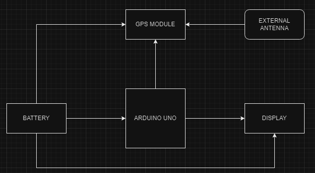
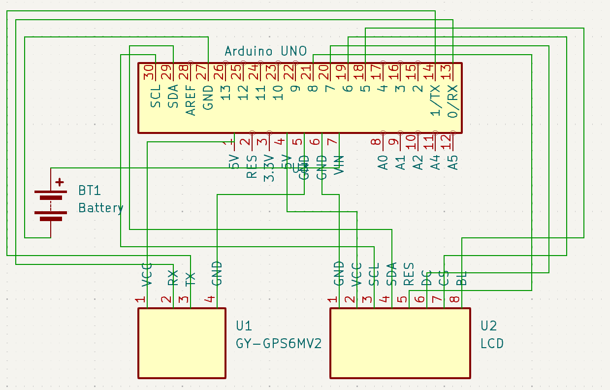

Pokémon Go

| | |
|-|-|
|`Author` | Băeșu Tudor-Iulian

## Description
This project aims to create a simplified, portable version of a location-based game.
## Motivation
It all started when I played Pokemon Go and I wanted to do something like that but not so complicated though
## Architecture
Hardware Components:

Arduino Uno/Nano: Acts as the central processing unit, managing inputs from the GPS module and driving the display.
GY-NEO6MV2 GPS Module: Provides real-time location data.
0.49'' OLED Display (64x32): Displays game information and user interface elements.
External GPS Antenna: Enhances signal reception, particularly in environments where GPS signals are weak.
Power Supply (Battery): Ensures the portability of the device.
Software Components:

Arduino IDE: Used for programming the Arduino with necessary libraries and custom scripts.
TinyGPS++: Parses incoming data from the GPS module to readable location coordinates.
Adafruit SSD1306: Manages the OLED display for outputting text and graphics.
SoftwareSerial: Enables communication between the Arduino and GPS module on pins other than the default serial pins.
### Block diagram

<!-- Make sure the path to the picture is correct -->

### Schematic

### Components

| Device | Usage | Price |
|--------|--------|-------|
| Arduino UNO board | Board | [35 RON](https://www.optimusdigital.ro/ro/compatibile-cu-arduino-uno/1678-placa-de-dezvoltare-compatibila-cu-arduino-uno-atmega328p-i-ch340.html?search_query=placa+arduino+uno&results=85) |
| GPS Module GY-NEO6MV2 with antenna | GPS | [45 RON](https://www.optimusdigital.ro/ro/gps/105-modul-gps-gy-neo6mv2.html?search_query=gps&results=54) |
| 1.44'' LCD module with SPI and ST7735 Controller (128x128 px) | Display | [15 RON](https://www.optimusdigital.ro/ro/optoelectronice-lcd-uri/3552-modul-lcd-de-144-cu-spi-i-controller-st7735-128x128-px.html?search_query=lcd&results=211) |
| Push Button | Button | [1 RON](https://www.optimusdigital.ro/ro/butoane-i-comutatoare/1119-buton-6x6x6.html?search_query=buton&results=222) |
| Jumper Wires | Connecting components | [7 RON](https://www.optimusdigital.ro/ro/fire-fire-mufate/884-set-fire-tata-tata-40p-10-cm.html?search_query=set+fire&results=110) |
| Breadboard | Project board | [10 RON](https://www.optimusdigital.ro/ro/prototipare-breadboard-uri/8-breadboard-830-points.html?search_query=breadboard&results=145) |

### Libraries

<!-- This is just an example, fill in the table with your actual components -->

| Library | Description | Usage |
|---------|-------------|-------|
| [TinyGPS++](https://www.arduino.cc/reference/en/libraries/tinygps/) | A compact library for parsing data from GPS modules. | Used for accesing the peripherals of the microcontroller  |
| [Adafruit SSD1306](https://www.arduino.cc/reference/en/libraries/adafruit-ssd1306/) | Library for SSD1306-based OLED/LED matrices. | Used for controlling the 0.49'' OLED display to show game information and status messages.  |
| [SoftwareSerial](https://docs.arduino.cc/learn/built-in-libraries/software-serial/) | oAllows serial communication on other digital pins of the Arduino. | Used for communicating with the GPS module if there are no free hardware serial ports.  |
| [Adafruit GFX Library](https://www.arduino.cc/reference/en/libraries/adafruit-gfx-library/) | A powerful library that provides drawing functionality for a variety of displays. | Used to draw text, shapes, and other graphics on the OLED display.  |
| [Wire](https://www.arduino.cc/reference/en/#variables) | Enables I2C communication, used by many sensors and peripherals. | Used for interfacing with the OLED display via the I2C bus.  |

## Log

<!-- write every week your progress here -->

### Week 6 - 12 May

### Week 7 - 19 May

### Week 20 - 26 May

## Reference links

<!-- Fill in with appropriate links and link titles -->

[Tutorial 1](https://forum.arduino.cc/t/beginners-guidance-gps-module-neo-6m/889018)

[Article 1](https://forum.arduino.cc/t/how-to-connect-neo-6m-gps-module/939321)

